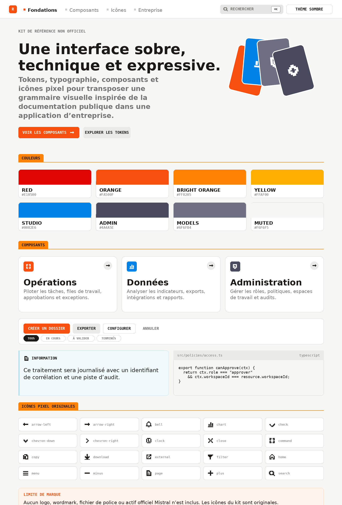

# Enterprise App Bootstrap & Style Reference Kit

Ce dépôt contient deux packages indépendants : un socle d'application d'entreprise et un kit de style.

- `packages/enterprise-app-bootstrap` : une application Next.js / React / TypeScript qui sert de base à des outils internes comme un back-office, une console d'administration ou un portail B2B. Le RBAC serveur, l'audit, les workflows, le multi-organisation et le design system sont déjà en place.
- `packages/mistral-style-reference-kit` : un kit visuel (tokens, composants CSS, icônes) qui reprend le style visuel public de la documentation Mistral. Kit non officiel.

Vous pouvez utiliser les deux ensemble ou chacun de son côté.

## Structure du dépôt

```text
enterprise-app-bootstrap-kit/
├── README.md
├── docs/
│   ├── enterprise-app-bootstrap.md     Guide complet du socle
│   └── mistral-style-reference.md      Guide de style
├── preview/
│   ├── mistral-style-showcase.html     Démo clair/sombre à ouvrir dans un navigateur
│   └── mistral-style-preview.png
├── scripts/
│   └── publish.sh                      Rattache un remote Git et pousse main
└── packages/
    ├── enterprise-app-bootstrap/
    └── mistral-style-reference-kit/
```

## Le socle : enterprise-app-bootstrap

### Stack

| Domaine | Outils |
|---|---|
| Framework | Next.js 16 (App Router), React 19, TypeScript strict |
| Interface | Tailwind CSS 4, Radix UI, class-variance-authority, lucide-react, next-themes |
| Données et formulaires | TanStack Table, React Hook Form, Zod, date-fns |
| Interactions | cmdk pour la command palette, sonner pour les toasts |
| Qualité | ESLint, TypeScript, Vitest, Testing Library, Playwright |
| Exploitation | GitHub Actions, Docker multi-stage, Compose |

### Les écrans

| Route | Contenu |
|---|---|
| `/dashboard` | KPIs, graphique, activité récente, alertes |
| `/work` | File de tâches avec priorités, statuts, propriétaires et filtres |
| `/records` | Table métier : recherche, tri, filtres, sélection, pagination |
| `/reports` | Reporting, segmentation, export |
| `/approvals` | Workflow de décision à double contrôle |
| `/audit-log` | Journal d'audit avec corrélation et export CSV |
| `/settings` | Profil de l'organisation, formulaire validé |
| `/settings/members` | Membres, rôles, gestion des accès |
| `/settings/security` | MFA, SSO, sessions, contrôles réseau |
| `/settings/feature-flags` | Activation progressive des fonctionnalités |
| `/help` | Centre d'aide |
| `/api/health` | Sonde de santé |
| `/api/records` | API d'exemple protégée par permissions |

### Architecture

L'application est un monolithe modulaire. Une requête traverse toujours les mêmes couches :

```text
Route / UI → Composant de feature → Service applicatif → Policy + validation → Repository → Infrastructure
```

```text
src/app          Routes, layouts et handlers Next.js
src/components    Design system (ui/), patterns (common/), shell (layout/), thème (theme/)
src/config        Navigation, produit, feature flags, workspaces
src/features      Modules métier : dashboard, work, records, approvals, audit, settings, auth
src/server        Services, repositories, policies, audit, events, jobs, idempotency, intégrations
src/lib           Erreurs, formatage, observabilité
src/types         Types partagés
```

Les couches suivent un sens de dépendance précis. Un repository ignore React, un composant d'interface ignore la base de données, et tout passe par la chaîne service → policy → repository. Le détail est dans [`packages/enterprise-app-bootstrap/docs/ARCHITECTURE.md`](packages/enterprise-app-bootstrap/docs/ARCHITECTURE.md).

### Rôles et permissions

Six rôles sont définis : `owner`, `admin`, `manager`, `analyst`, `member`, `viewer`. Chacun reçoit une liste de permissions (`records.write`, `approvals.review`, `security.manage`...) dans [`src/features/auth/permissions.ts`](packages/enterprise-app-bootstrap/src/features/auth/permissions.ts).

L'autorisation se décide sur le serveur. L'interface cache les actions hors de portée de l'utilisateur, et le service applicatif revérifie la permission avant chaque écriture.

### Sécurité

L'authentification est simulée pour la démo et se branche sur OIDC ou SAML le moment venu. Le RBAC tourne côté serveur, les entrées passent par Zod, les actions sensibles sont auditées et `next.config.ts` pose quelques en-têtes HTTP de base. La liste des contrôles à ajouter avant la prod (CSP, gestion des secrets, rate limiting, sauvegardes, tests d'isolation entre tenants) est dans [`docs/SECURITY.md`](packages/enterprise-app-bootstrap/docs/SECURITY.md) et [`SECURITY.md`](packages/enterprise-app-bootstrap/SECURITY.md).

### Lancer le projet

```bash
cd packages/enterprise-app-bootstrap
cp .env.example .env.local
npm install
npm run dev
```

Rendez-vous sur `http://localhost:3000`. La session de démo utilise le rôle `admin`. Pour essayer un autre rôle, changez `MOCK_ROLE` dans `.env.local` : `owner`, `admin`, `manager`, `analyst`, `member` ou `viewer`.

### Commandes

```bash
npm run lint         # ESLint
npm run type-check   # tsc --noEmit
npm run test         # Vitest
npm run build        # Build de production
npm run test:e2e     # Playwright (lancez d'abord npx playwright install chromium)
```

### Docker

```bash
cp .env.example .env
docker compose up --build
```

Le Dockerfile passe par trois étapes (`deps`, `builder`, `runner`), s'appuie sur le mode standalone de Next.js et démarre avec un utilisateur sans privilège.

### Ce qu'il reste à brancher pour la production

Plusieurs adaptateurs tournent en mémoire pour faire fonctionner la démo. Voici leur équivalent en production :

| Brique | Démo | Production |
|---|---|---|
| Authentification | session simulée | IdP OIDC/SAML |
| Autorisation | RBAC en mémoire | policies, scopes et tests d'isolation |
| Données | repository en mémoire | base transactionnelle (PostgreSQL) |
| Audit | logs structurés | stockage append-only |
| Jobs | exécution dans le process | file durable avec dead-letter |
| Événements | console | outbox et broker |
| Feature flags | config et variables d'env | provider dédié |
| Intégrations | `integrationFetch()` | retries, circuit breaker, secrets gérés |
| Observabilité | logger minimal | logs, métriques et traces (OpenTelemetry) |

Le guide complet, avec les profils de configuration et la checklist de fork, est dans [`docs/enterprise-app-bootstrap.md`](docs/enterprise-app-bootstrap.md).

## Le kit visuel : mistral-style-reference-kit

> Kit non officiel. Il s'appuie sur les éléments visuels publics de la documentation Mistral (dépôt `mistralai/platform-docs-public`, sous Apache 2.0) et sur l'observation de l'interface. Aucun logo, wordmark, emblème, illustration de modèle, capture officielle ou fichier de police n'est redistribué. Les icônes sont dessinées pour le kit et le CSS est réécrit de zéro. Avant une mise en production : renommez les tokens, remplacez la palette par celle de votre marque, et gardez le kit à l'écart de toute présentation comme produit Mistral.

### Contenu

```text
tokens/        Couleurs (OKLCH et hex), typographie, espacements — JSON, CSS, preset Tailwind
components/    Composants CSS autonomes : boutons, cartes, tabs, callouts, tables, code blocks
icons/         24 icônes pixel dessinées pour le kit — SVG, sprite, composant React
integration/   Exemples React à adapter : Button, ProductCard, SectionTab, ThemeToggle
preview/       Aperçu HTML interactif et capture PNG
source/        Carte des sources publiques analysées et notices tierces
LICENSES/      Copie de la licence Apache 2.0 du dépôt cité
```

### Utilisation

```html
<link rel="stylesheet" href="./tokens/theme.css">
<link rel="stylesheet" href="./components/components.css">
<body class="theme-mistral-reference msr-app">
```

Pour voir le rendu sans rien installer, ouvrez [`preview/mistral-style-showcase.html`](preview/mistral-style-showcase.html) ou [`packages/mistral-style-reference-kit/preview/index.html`](packages/mistral-style-reference-kit/preview/index.html).



Le guide de style détaillé (palette, typographie, géométrie, mouvement, composants, accessibilité) se trouve dans [`docs/mistral-style-reference.md`](docs/mistral-style-reference.md) et dans la version longue [`packages/mistral-style-reference-kit/STYLE_GUIDE.md`](packages/mistral-style-reference-kit/STYLE_GUIDE.md).

## Toute la documentation

| Fichier | Sujet |
|---|---|
| [`docs/enterprise-app-bootstrap.md`](docs/enterprise-app-bootstrap.md) | Guide du socle : philosophie, stack, modules, sécurité, données, tests, CI/CD, déploiement, fork |
| [`docs/mistral-style-reference.md`](docs/mistral-style-reference.md) | Guide de style condensé |
| [`packages/enterprise-app-bootstrap/docs/ARCHITECTURE.md`](packages/enterprise-app-bootstrap/docs/ARCHITECTURE.md) | Couches, dépendances, multi-tenant, extraction d'un service |
| [`packages/enterprise-app-bootstrap/docs/SECURITY.md`](packages/enterprise-app-bootstrap/docs/SECURITY.md) | Authentification, autorisation, audit, secrets, pipeline, checklist prod |
| [`packages/enterprise-app-bootstrap/docs/DESIGN_SYSTEM.md`](packages/enterprise-app-bootstrap/docs/DESIGN_SYSTEM.md) | Tokens, typographie, composants, patterns métier, accessibilité |
| [`packages/enterprise-app-bootstrap/docs/ADDING_A_MODULE.md`](packages/enterprise-app-bootstrap/docs/ADDING_A_MODULE.md) | Ajouter un module métier de bout en bout |
| [`packages/mistral-style-reference-kit/STYLE_GUIDE.md`](packages/mistral-style-reference-kit/STYLE_GUIDE.md) | Référence de style complète |
| [`packages/mistral-style-reference-kit/source/SOURCE_MAP.md`](packages/mistral-style-reference-kit/source/SOURCE_MAP.md) | Sources analysées et éléments écartés |
| [`packages/mistral-style-reference-kit/integration/USAGE.md`](packages/mistral-style-reference-kit/integration/USAGE.md) | Intégrer les composants React du kit |

## Licence

Le code du socle et les éléments originaux du kit (composants, tokens, icônes) n'ont pas encore de licence open source déclarée. Tant qu'aucun fichier `LICENSE` n'est ajouté, tous les droits restent réservés.

La documentation publique de Mistral citée par le kit est sous Apache 2.0. Sa licence est recopiée dans [`packages/mistral-style-reference-kit/LICENSES/Apache-2.0.txt`](packages/mistral-style-reference-kit/LICENSES/Apache-2.0.txt) à titre d'attribution. Elle couvre la source citée, pas le kit, et ne donne aucun droit sur les marques Mistral. Les marques et noms de produits tiers appartiennent à leurs détenteurs.
